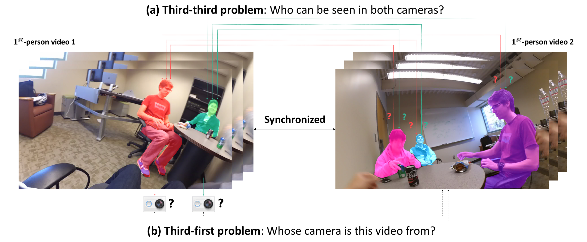

# Joint Person Segmentation and Identification in Synchronized First- and Third-person Videos

## Introduction

This is a PyTorch implementation for our ECCV 2018 paper "[`Joint Person Segmentation and Identification in Synchronized First- and Third-person Videos`](https://arxiv.org/pdf/1803.11217.pdf)".

## Environment

The code is developed with CUDA 8.0, ***Python 2.7***, ***PyTorch 0.3***

## Data Preparation

- Download IU ShareView dataset and pretrained models at [`http://vision.soic.indiana.edu/firstthird-eccv2018`](http://vision.soic.indiana.edu/firstthird-eccv2018).

## Citations

If you are using the data/code/model provided here in a publication, please cite our paper:

    @inproceedings{firstthirdseg2018eccv,
        title = {Joint Person Segmentation and Identification in Synchronized First- and Third-person Videos},
        author = {Mingze Xu and Chenyou Fan and Yuchen Wang and Michael S. Ryoo and David J. Crandall},
        booktitle = {European Conference on Computer Vision (ECCV)},
        year = {2018}
    }
